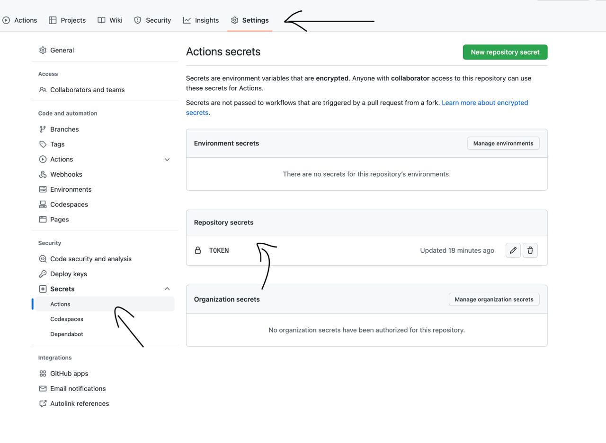

### Task #1 (4 points)

Suppose you have a text file with a list of cities. You can choose any convenient format for storing cities – a `csv` table with cities, a `txt` file, or any others. Let's assume that all cities are different in the input file. Implement a console application that, for each city in this list, finds the current weather. To do this, you can use the open API of the `OpenWeatherMap` service: https://openweathermap.org/current. If there are several cities with the same name, you need to take the results for the first one in the response. Don't forget to convert the received temperature into Celsius.

CLI arguments for passing the path to the file with cities can be processed manually or by using any library you know of, like [Clikt](https://ajalt.github.io/clikt/).

You need to implement a `GET` request in which you specify the city and the response data format (`JSON` is best). You also need to specify the API Key, which you can create in your account. _Do not store keys on GitHub – please use environment variables._

To optimize the execution time, all requests should be executed asynchronously. When the response is received, the name of the city and weather should be displayed in the console.

**Suggestion**: Implement the synchronous solution first. You will get get 1.5 points for this. If you have time, support the asynchronous requests.

**Hint**: You can find an example of a GET query in the [Main.kt](./src/main/kotlin/jub/test2/Main.kt) file.

### Generating API Key

To generate an API key, do the following:
1) Register here - https://openweathermap.org/

Wait about 10-15 minutes.

### How to upload the API Key to the repository to have access from GitHub Actions

1) Go to the `Settings` in the repository.
2) Go to the `Secrets-Actions`.
3) Add the key to the `Repository secrets` with the `TOKEN` name.

### Useful links

1. [How to set up an environment variable on MacOS](https://apple.stackexchange.com/questions/395457/how-to-set-environment-variable-permanently-in-zsh-on-macos-catalina). 
Don't forget to restart IDEA.
2. [How to set up an environment variable on Ubuntu](https://askubuntu.com/questions/887442/how-to-permanently-set-an-environment-variable).
   Don't forget to restart IDEA.
3. [How to set up an environment variable on Windows](https://stackoverflow.com/questions/5898131/set-a-persistent-environment-variable-from-cmd-exe).
   Don't forget to restart IDEA.